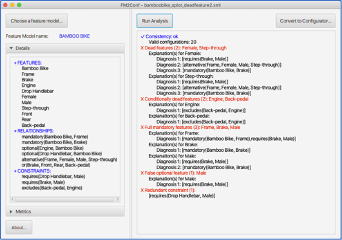

# FM2ExConf

**FM2ExConf** is a tool for converting a feature model into an Excel-based configurator.
An Excel-based configurator provides an executable representation of configuration knowledge in Microsoft Excel.

FM2ExConf has two key functionalities:
1.	Detecting and explaining feature model anomalies
2.	Converting a consistent feature model into an Excel-based configurator

## Requirements

The tool is a standalone Java application.
To use the tool,
please _download the latest executable JAR file [fm2exconf-1.0.3.jar]()_ and _install the latest version of Java_
(Java version 8 update 270 or later).

#### Install Java

If you have not installed Java or the Java version isn't the latest one,
please go to Java's website at https://www.java.com/en/download/
and click on the **Java Download** button to download the latest version and then install it.

For further details of Java installation and JAR File running on a Windows or Mac computer,
please follow a step-by-step guide at https://www.wikihow.com/Run-a-.Jar-Java-File.

## How to use the tool

_If you need a more intuitive guide, please watch the tutorial [video](guide%2Ftutorial.mp4)._

#### Input and output

The tool's input is a feature model file, and the output is an Excel file representing a corresponding Excel-based configurator.
The tool supports the following formats of feature model files:
-	_SXFM format (*.xml)_ from [S.P.L.O.T]
-	_FeatureIDE format (*.xml)_ from [FeatureIDE]
-	_GFM format (*.json)_ from [Glencoe]
-	_v.control XMI format (*.xmi)_ from [Logic4Business]

**Note:** Please use [S.P.L.O.T], [FeatureIDE], or [Glencoe] to create your own feature models.
You can also try with our example feature models in the folder **feature models**.

#### Detecting and Explaining Feature Model Anomalies

After loading a feature model file, you can click on the button **Run Analysis** to perform a feature model analysis.
The results are shown in the text area.

The tool can detect _six_ types of feature model anomalies and generate corrective explanations
(in the form of diagnoses) to resolve the anomalies.
The detected anomalies are the followings:
•	_Void feature model_ is a feature model that represents no configurations.
•	_A dead feature_ is a feature that is not included in any of the possible configurations.
•	_A conditionally dead feature_ is a feature that becomes dead under certain circumstances
(e.g., when including other feature(s) in a configuration).
•	_A full mandatory feature_ is a feature that is included in every possible solution.
•	_A false optional feature_ is a feature that is included in all configurations,
although it has not been modeled as mandatory.
•	_A redundant constraint_ is a constraint
whose semantic information has already been modeled in another way in other constraints/relationships of the feature model.

**Note:** _A consistent feature model could contain anomalies._

An example explanation can be found in the above Figure.
The tool detects that the feature model is consistent.
However, “Female” is detected as a dead feature.
In this context, the tool generates three corrective explanations represented as diagnoses:
-	Explanation 1 (Diagnosis 1): _requires(Brake, Male)_
-	Explanation 2 (Diagnosis 2): _alternative(Frame, Female, Male, Step-through)_
-	Explanation 3 (Diagnosis 3): _mandatory(Bamboo Bike, Brake)_.

These explanations show
how to delete/adapt the relationships/constraints in the feature model to resolve the mentioned anomaly.
For instance, the dead feature “Female” can be resolved if the stakeholder performs _ONE out of three_ suggestions:
-	Delete/Adapt the **_requires_** constraint between “Brake” and “Male”;
-	Delete/Adapt the **_alternative_** relationship between “Frame” and its sub-features (“Female”, “Male”, “Step-throught”);
-	Delete/Adapt the **_mandatory_** relationship between “Bamboo Bike” and “Brake.”

#### Converting a Consistent Feature Model into an Excel-based Configurator

By clicking the button **Convert to Configurator**, the tool converts a feature model into an Excel-based configurator.
_Please note that the feature model should be consistent before being converted_.

The tool allows you to set the options of the configurator as follows:
1.	The order of features in the first column (breadth-first order or depth-first order)
2.	The state of a feature (a binary value (1/0) or a logical value (True/False) indicating a feature is included/excluded)
3.	Adding the services of features (e.g., price)

After converting, the generated Excel-based configurator will be automatically opened.

## Excel-based configurator
In the Excel-based configurator,
a user can select or deselect features by filling 1/True or 0/False value into yellow cells
(in column B) to find the desired configuration.

When a user's selection triggers an inconsistency, corrective explanations will be shown in column D's cells.
These corrective explanations guide the user to fix his/her selections
and therefore help to recover the configuration's consistency.
On the contrary, if the messages in all column D cells are "ok," then the current configuration is consistent.

## Contact
For any questions or issues regarding the tool, please do not hesitate to contact me - Viet-Man Le
([vietman.le@ist.tugraz.at](vietman.le@ist.tugraz.at)).

[S.P.L.O.T]: http://www.splot-research.org
[FeatureIDE]: https://featureide.github.io
[Glencoe]: https://glencoe.hochschule-trier.de
[Logic4Business]: https://www.prostep.com